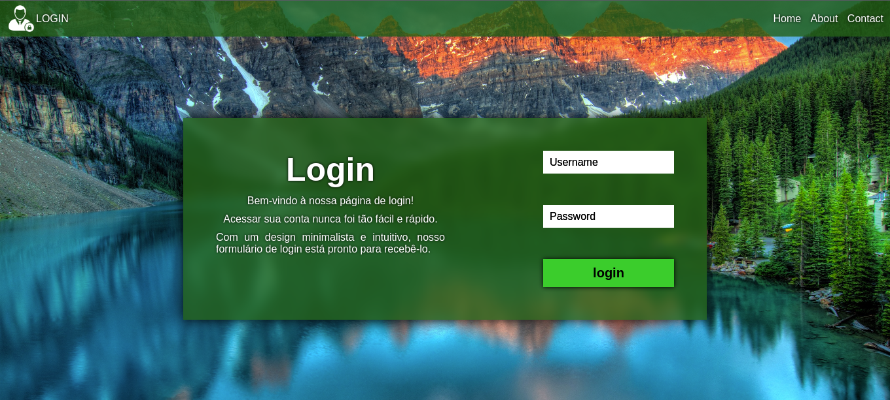

# Formulário para logar na conta

**Linguagens usadas:** HTML5 e CSS3

*Faz alguns anos desde que estudei HTML e CSS. Como não estou utilizando CSS atualmente, decidi testar minha memória criando um pequeno projeto visual de uma página de login, explorando minha criatividade em relação às cores.*

*Peço desculpas antecipadamente caso a imagem de fundo não seja carregada corretamente, pois ela tem um tamanho de arquivo bastante pesado.*

## Preview

